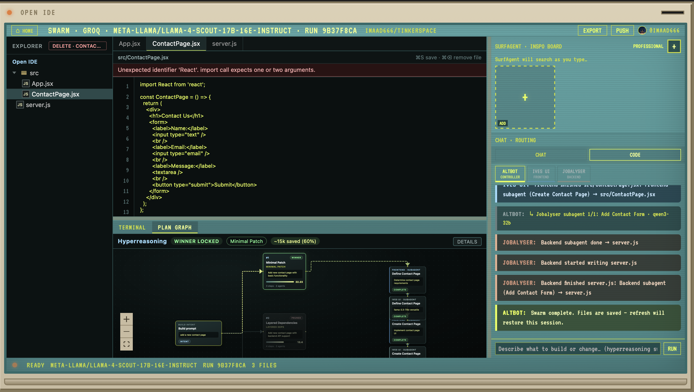
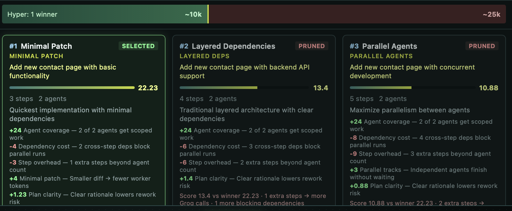
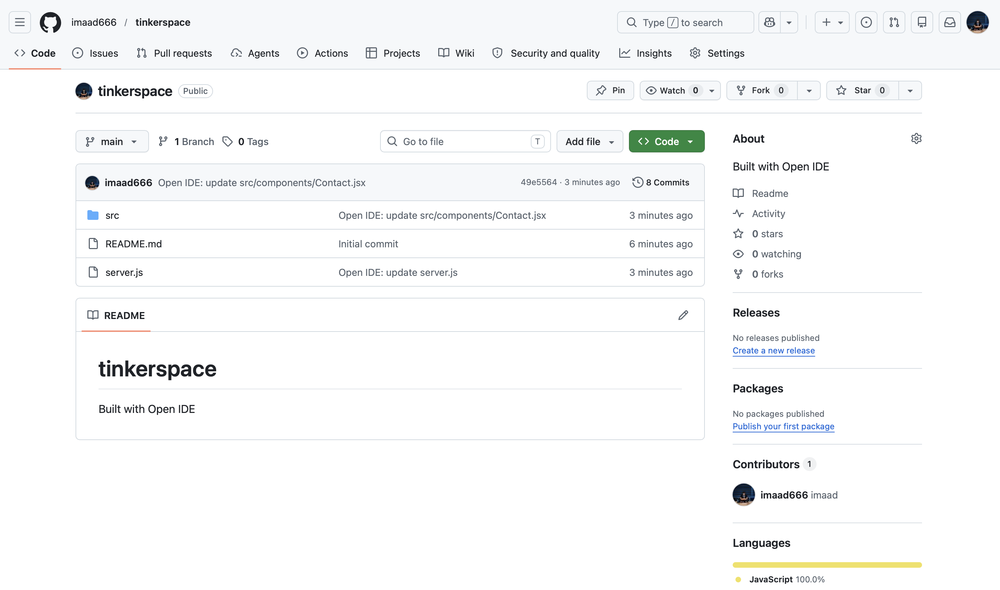

# Open IDE
Visit : https://openide-codex.vercel.app
## Overview

Open IDE is a CRT-themed, multi-agent coding IDE. You connect a GitHub repo, describe what you want built, and watch Altbot run hyperreasoning across three architectural plan branches before specialist agents stream code into a live workspace, push directly to GitHub or save as a zip.

## Problem Statement

AI coding tools often feel like copying code out of a chat window. Reasoning is hidden, one model does everything, token usage balloons, and there is no real tie to a repository you can edit, run, preview, or ship.

Builders need a way to see architecture get decided before code is written, watch specialized agents work in parallel, and land in an IDE that respects their repo — not another paste bin.

## Solution

Open IDE runs a three-stage pipeline over **Groq** — plan, execute, ship — with the repo as source of truth.

**1. Hyperreasoning (Altbot · `llama-4-scout`)**  
Altbot calls Groq with structured JSON output to generate three distinct architectural branches, score them on feasibility/complexity/fit, prune the losers, and emit a dependency-aware execution plan. The search graph (React Flow + dagre) renders branches, pruning, and the winning path before any code is written — cutting wasted tokens on bad plans.

**2. Swarm execution (lane subagents · per-model Groq workers)**  
Selected card agents spawn step-scoped subagents — one Groq call per plan step, streamed over **SSE** from Express:

| Agent | Model | Lane |
|-------|-------|------|
| **Ives UI** | `llama-3.3-70b-versatile` | React, CSS, layout, components |
| **Jobalyser** | `qwen/qwen3-32b` | APIs, `server.js`, routes, middleware |
| **WzData** | `llama-3.1-8b-instant` | Schemas, SQL, migrations, data contracts |

Files stream into the workspace in real time via chunked SSE events. Payloads are throttled and trimmed to stay within Groq TPM limits.

**3. IDE + GitHub sync**  
The user edits in a lightweight code editor with lint feedback, runs terminal/git helpers, chats with lane specialists, and pushes the live workspace to GitHub via the **REST Contents API** (OAuth). Sessions and runs persist in **Vercel Blob** (or local `.open-ide/` in dev). Export as zip or preview when `server.js` is present.

Hyperreasoning first. Specialists second. Repo central throughout.

## Features

- CRT intro flow with GitHub oAuth, prompt entry, and agent card selection
- Hyperreasoning — three plan branches, scoring, pruning, and live search/execution graphs
- Step-scoped subagents per lane (Frontend, Backend, Database) with per-agent Groq models
- Editable code workspace — file explorer, save flow (⌘S), syntax lint, delete + push sync
- Integrated terminal panel with workspace and GitHub-aware git helpers
- Agent chat — talk to Altbot or lane specialists; Code mode triggers a new swarm
- GitHub OAuth — open/create repos, import files, push workspace, clear remote repo
- Session restore across refreshes
- Zip export, local preview (when `server.js` exists), Vercel-ready deployment

## Tech Stack

- **Frontend:** React 18, Vite, React Flow, dagre, custom code editor
- **Backend:** Node.js, Express, REST, Server-Sent Events (SSE)
- **Database:** Vercel Blob
- **APIs:** Groq (planning, generation, subagents, chat), GitHub REST + OAuth, Vercel Blob
- **Hosting:** Vercel

## Codex / OpenAI Usage

OpenAI Codex was used as an AI coding collaborator during development of this repository. Groq powers the live product at runtime.

| Area | How Codex / OpenAI was used |
|------|-----------------------------|
| Ideation | Product flow, agent personas, hyperreasoning UX |
| Architecture planning | SSE migration, session storage, serverless/Vercel layout |
| Code generation | Feature implementation across `server.js`, agents, and React UI |
| Debugging | Groq payload errors, repo import, session restore, GitHub push sync |
| Testing | Build verification, local dev flow checks |
| Documentation | README drafting and structure |
| API integration | GitHub OAuth, Groq per-agent config, Vercel Blob patterns |


## Demo

Demo video link: https://drive.google.com/file/d/1FVWv8SgT-vSI_ToOFzJ1kKepLAfEUPgn/view?usp=drivesdk

## Screenshots

### Welcome Screen


### Agents Screen


### IDE


### Reasoning Section


### GitHub Repo created by OpenIDE


## How to Run Locally

```bash
git clone https://github.com/imaad666/codex_kochi
cd codex_1
npm install
cp .env.example .env
npm run dev
```

Add your Groq API key to `.env`:

```bash
GROQ_API_KEY=your_key_here
```

Get a key at [console.groq.com/keys](https://console.groq.com/keys).


Local URLs:

- Frontend: `http://localhost:5173`
- Backend: `http://localhost:3001`

